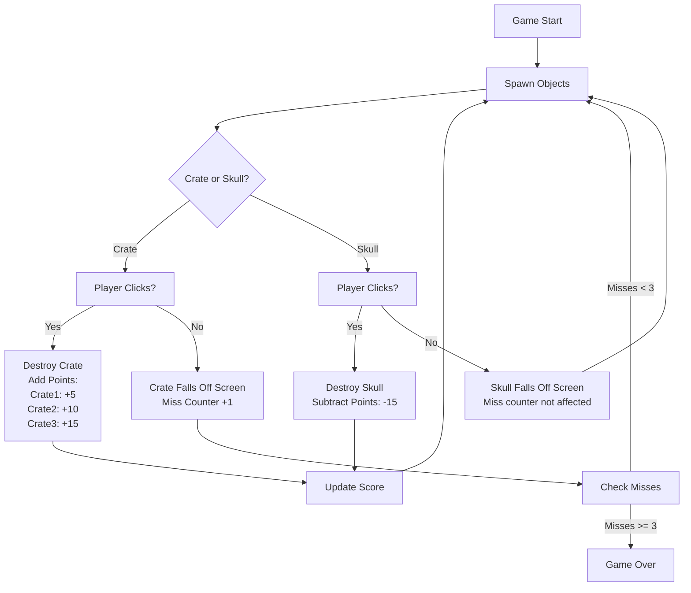

# Clicky Crates - Unity learning school project
> Clicky Crates is a fast-paced game where players must click on objects that are tossed into the air before they fall off the screen, while avoiding clicking on skulls that subtract points. Missing three objects ends the game, and the goal is to achieve the highest score possible by reacting quickly and accurately.

## Planning Document

### Game Design

**State your idea:**  
The game challenges players to click on crates that are tossed into the air before they fall off the screen. Players must avoid clicking on skulls, which decrement their score, and the game ends if too many crates are missed.

**Is the main focus/task in the game provided:**  
Yes, the main focus is to click and destroy crates as quickly as possible while avoiding skulls. The core task is simple: react quickly to click the correct objects and achieve a high score.

**Who is the target audience:**  
The target audience is beginners and junior programmers, typically aged 12 and above, who are learning game development and basic programming concepts in Unity.

**How will the game be suitable for them, e.g. language, graphical content:**  
The game uses easy words and clear pictures. The graphics are bright, colorful, and safe for everyone.

**State at least 2 of the game mechanics that will be used:**

1. You use your mouse to click on crates and break them to get points.
2. You need to watch out for bombs, don't click on them or you'll lose points.
3. Crates and bombs fly up then fall down, so you have to be quick.

### Flowchart
